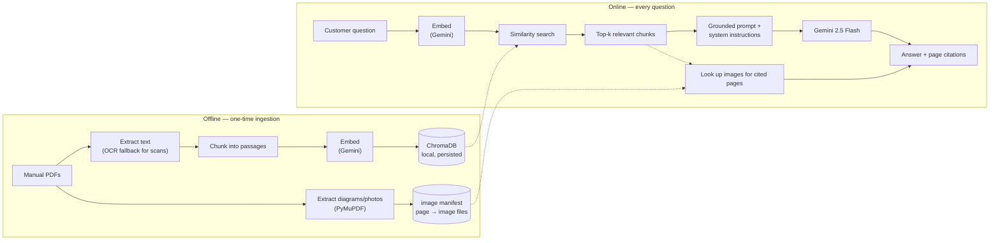

# Refrigerator Manual Assistant (RAG)

> **Independent demo/portfolio project — not affiliated with, endorsed by, or sponsored by Panasonic.** Built against real, publicly available Panasonic refrigerator manuals to demonstrate a retrieval-augmented generation pipeline end to end.

A chat assistant that answers customer questions about a refrigerator — installation, control panel settings, error codes, cleaning, Wi-Fi setup — by retrieving the relevant passage from the actual manual PDF and answering only from that, instead of making the customer search a 20-page document themselves.

**[Live demo →]()** *(add your deployed URL here once you've followed the deploy steps below)*

---

## The problem

Appliance manuals are long, dense, and organized for completeness, not for "I just want to know one thing." A customer who wants to know what error code `E1` means, or how to enable the energy-saving mode, has to download a PDF and search it themselves. Support teams field the same handful of questions repeatedly. A manual-grounded chat assistant answers the question directly, in seconds, and cites the page it came from — while refusing to guess when the manual doesn't cover something (important for anything safety-related).

## What's actually in this repo

This was built and tested against **16 real manual PDFs** sourced from Panasonic's own site, covering roughly **20 refrigerator model numbers** plus a smart/Wi-Fi (MirAIe app) setup guide — not a single toy example:

| | |
|---|---|
| Manuals tested | 16 PDFs (some cover two model variants each) |
| Total pages | 250 |
| Chunks after ingestion | 625 |
| Diagrams/photos extracted | 69 (control panels, clearance diagrams, app screenshots) |
| Languages | English + Hindi (two manuals) |
| Scanned (image-only) manuals | 1 — recovered via OCR fallback |

Manual PDFs themselves aren't committed to this repo (see [Why the manuals aren't in this repo](#why-the-manuals-arent-in-this-repo)) — you add your own to `backend/data/manuals/` and run one ingestion command.

## Architecture



**No LangChain or LlamaIndex.** PDF parsing, chunking, and prompt construction are hand-rolled in plain Python (`backend/app/pdf_utils.py`, `backend/app/rag.py`) — a deliberate choice so every step is a few lines of readable code instead of a framework abstraction, which matters for a project meant to demonstrate understanding of how RAG actually works.

**Embeddings via the Gemini API, not a local model.** No sentence-transformers/PyTorch dependency, which keeps the backend light enough to actually run on a free-tier host (see [Deployment](#deployment)) instead of hitting an out-of-memory error on a 512 MB instance.

## Tech stack

| Layer | Choice | Why |
|---|---|---|
| Backend | Python, FastAPI | Best library support for PDF/embedding/vector-store work |
| PDF extraction | pypdf + Tesseract OCR fallback | Handles both normal and scanned manuals |
| Image extraction | PyMuPDF (`fitz`) | Local/open-source, no extra API key — pulls diagrams and photos out alongside the text |
| Vector store | ChromaDB (local, persisted to disk) | Free, no separate service to run, plenty for a few hundred–few thousand chunks |
| Embeddings | Gemini (`gemini-embedding-001`) | Free tier, no local model to load |
| Generation | Gemini (`gemini-2.5-flash`) | Free tier, fast, good enough for grounded QA |
| Frontend | Vanilla HTML/CSS/JS | No build step — stays a simple embeddable widget |

## How it works

**Ingestion** (`python -m app.ingest`, run once, or after adding/changing manuals):
1. Every PDF in `data/manuals/` is read page by page. If a page has no embedded text layer (a scanned manual), it's rasterized and run through Tesseract instead.
2. Each page's text is split into overlapping ~900-character chunks along sentence boundaries, so context isn't lost mid-sentence at chunk edges.
3. Each chunk is embedded and stored in ChromaDB, tagged with `manual` (a friendly model label like `NR-CY550`, parsed from the filename) and `page`.
4. In parallel, embedded diagrams and photos are extracted from each page with PyMuPDF (filtering out small decorative/background elements) and saved, with a `{manual, page} → [image files]` manifest written alongside the vector store.

**Answering a question** (`POST /api/ask`):
1. The question is embedded the same way.
2. The 5 most similar chunks are pulled from ChromaDB (skipped if nothing clears a minimum similarity bar, rather than forcing an answer from irrelevant context).
3. Those chunks, with their manual/page tags, are handed to Gemini with a system prompt that requires it to answer only from them, say so when they don't cover the question, and flag it — rather than silently pick one — when two different models' manuals disagree (which genuinely happens: `E1` means something different in different manuals in this test set).
4. Any diagrams/photos on the cited pages are looked up from the image manifest and returned alongside the answer — e.g. a clearance question comes back with the installation diagram, not just a paragraph describing it.
5. The answer is returned along with the sources (and images) it was built from.

### Validation

Before wiring in the real Gemini calls, the retrieval step was validated against the full 625-chunk corpus using a local TF-IDF stand-in (no API key needed, so this is fully reproducible offline — see `backend/app/pdf_utils.py` for the extraction/chunking it exercises). Even with that weaker, purely keyword-based substitute for real embeddings, retrieval correctly:
- surfaced the Wi-Fi/MirAIe setup guide for connectivity questions,
- surfaced only the manuals for models that actually have ECONAVI when asked about it (several models in this set don't have that feature at all),
- kept model-specific spec questions (e.g. "how much does the NR-CY550 weigh") attributed to the right manual.

Real Gemini embeddings, which capture meaning rather than just keyword overlap, should only improve on this.

## Project structure

```
.
├── AGENTS.md                  # briefing for agentic IDEs (Antigravity, etc.)
├── render.yaml                 # one-click backend deploy config
├── backend/
│   ├── app/
│   │   ├── main.py             # FastAPI routes
│   │   ├── rag.py              # retrieval + grounded generation
│   │   ├── ingest.py           # CLI: builds the index
│   │   ├── pdf_utils.py        # PDF extraction (+ OCR fallback) + chunking
│   │   ├── image_utils.py      # diagram/photo extraction (PyMuPDF)
│   │   ├── embeddings.py       # Gemini embedding calls
│   │   ├── vectorstore.py      # Chroma wrapper
│   │   ├── schemas.py          # request/response models
│   │   └── config.py           # settings + system prompt
│   ├── data/
│   │   ├── manuals/            # put your manual PDFs here (gitignored)
│   │   └── generate_sample_manual.py  # optional: makes a placeholder manual
│   ├── requirements.txt
│   ├── requirements-dev.txt    # only for generate_sample_manual.py
│   ├── Dockerfile
│   └── .env.example
└── frontend/
    ├── index.html
    ├── style.css
    ├── config.js                # <- set your backend URL here
    └── script.js
```

## Setup (local)

```bash
cd backend
cp .env.example .env
# edit .env and add GEMINI_API_KEY (free key: https://aistudio.google.com/apikey)

python -m venv .venv && source .venv/bin/activate   # optional but recommended
pip install -r requirements.txt

# Add your manual PDFs to data/manuals/. Don't have any handy? Generate a
# placeholder to test the pipeline:
#   pip install -r requirements-dev.txt
#   python data/generate_sample_manual.py

python -m app.ingest          # builds the vector store — re-run after changing manuals
uvicorn app.main:app --reload # serves on http://localhost:8000
```

Then open `frontend/index.html` directly in a browser (its `config.js` already points at `http://localhost:8000`).

## Deployment

This is set up to run entirely on free tiers so you end up with a real, shareable URL rather than just source code.

**Backend → [Render](https://render.com):**
1. Push this repo to GitHub.
2. In Render: **New → Blueprint**, point it at your repo. It reads `render.yaml` and provisions the service.
3. When prompted, paste in your `GEMINI_API_KEY`.
4. Once deployed, you still need manuals indexed: Render's free tier doesn't persist a disk between deploys, so either add an `data/manuals/` upload step to your build, or ingest via a one-off shell command in the Render dashboard after adding a persistent disk. (For a pure demo, ingesting a small manual set at build time in the Dockerfile is the simplest fix — see the comment in `backend/Dockerfile`.)
5. Note the free tier spins down after ~15 minutes of inactivity and takes 30-60s to wake up on the next request — expected on a demo, not something to "fix" unless you upgrade the plan.

**Frontend → [Netlify](https://netlify.com) or [Vercel](https://vercel.com):**
1. Point either at the `frontend/` folder as a static site (no build command needed).
2. Edit `frontend/config.js` to your deployed backend's URL before deploying (or template it as an env var if your host supports that for static sites).
3. Once you have both URLs, set `ALLOWED_ORIGINS` in the backend's environment to your frontend's exact origin instead of `*`.

## Why the manuals aren't in this repo

Manual PDFs are the manufacturer's copyrighted material. This repo ships the pipeline, tested against 16 real manuals during development, but doesn't redistribute those PDFs in version control — `.gitignore` keeps `data/manuals/*.pdf` local to your machine. Add your own (downloaded from the manufacturer's official site) and they'll work immediately; nothing about the code assumes any particular manual.

## Known limitations / what I'd do next

- **Images are page-matched, not independently searchable.** A diagram gets attached to an answer because it shares a page with a retrieved text chunk — the image content itself isn't embedded. Captioning each image with Gemini's vision capability at ingestion time (then embedding the caption) would let a question like "show me the clearance diagram" retrieve the right image even if the surrounding text chunk wasn't the top text match.
- **OCR quality on scanned manuals** is noisier on diagram-heavy pages (Tesseract does fine on body text, less well on stylized cover pages and dense diagrams). A production version might rasterize + vision-model those specific pages instead of pure OCR.
- **Chunking is sentence-greedy, not layout-aware** — occasionally interleaves text on true multi-column pages. `pdfplumber`'s layout mode would be the natural upgrade if this shows up as a real quality issue.
- **No conversation memory** — every question is independent. Follow-up questions like "what about for the freezer?" won't have prior context yet.
- **No feedback loop** — thumbs up/down on answers, logged and reviewed, would be the natural next step for actually improving retrieval quality over time.
- **Model selection isn't exposed in the UI yet**, though the API already supports it (`model_filter` in `POST /api/ask`) — letting a customer pick their exact model would tighten retrieval further.

## License

Code is MIT-licensed — see `LICENSE`. This does not extend to any manual PDFs you add locally, which remain the manufacturer's property.
